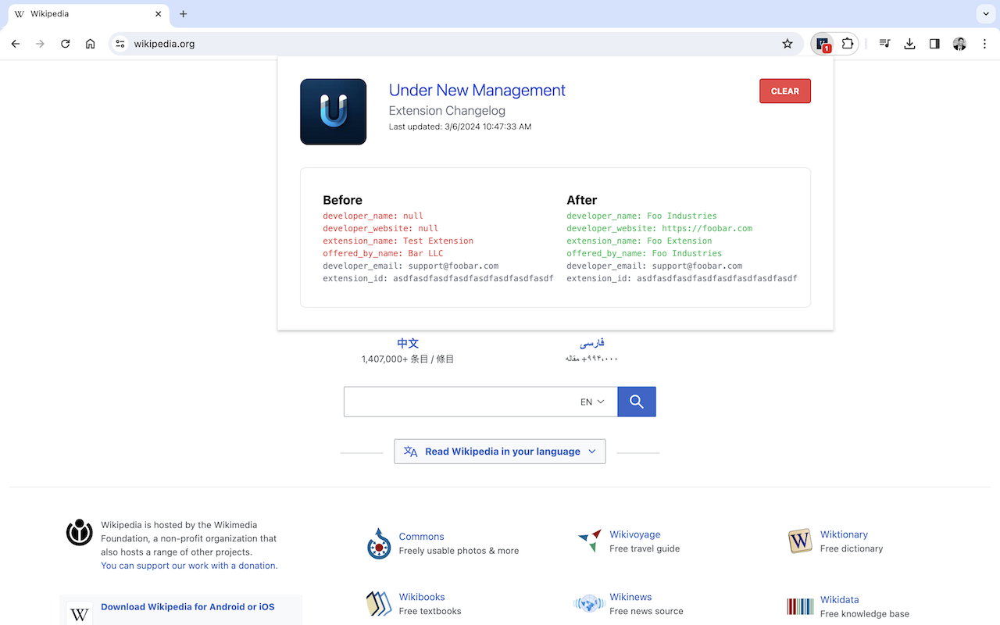

# Under New Management

**Detect when your extensions have changed owners**

Intermittenty checks your installed extensions to see if the developer information listed on the Chrome Web Store has changed. If anything is different, the extension icon will display a red badge, alerting you to the change.

Created by [Matt Frisbie](https://www.mattfriz.com/)

Media:

- [Hacker News discussion](https://news.ycombinator.com/item?id=39620060)
- [Featured in *tl;dr sec Newsletter*](https://tldrsec.com/p/tldr-sec-221)
- [Featured in *The Register*](https://www.theregister.com/2024/03/07/chrome_extension_changes/)
- [Featured on Security Now ep 965](https://youtu.be/HB8im8TuN1w?t=6613)

## Why is this needed?

Extension developers are [constantly getting offers to buy their extensions](https://github.com/extesy/hoverzoom/discussions/670). In nearly every case, the people buying these extensions want to rip off the existing users.

**The users of these extensions have no idea an installed extension has changed hands, and may now be compromised.**

Under New Management gives users notice of the change of ownership, giving them a chance to make an informed decision about the software they're using.

## Installation

Install for Chrome: [https://chromewebstore.google.com/detail/under-new-management/jppepdecgemgbgnjnnfjcmanlleioikj](https://chromewebstore.google.com/detail/under-new-management/jppepdecgemgbgnjnnfjcmanlleioikj?hl=en&authuser=0)

Install for Firefox (pending approval): [https://addons.mozilla.org/en-US/firefox/addon/under-new-management-v2/](https://addons.mozilla.org/en-US/firefox/addon/under-new-management-v2/)

OR

Download a [prebuilt release](https://github.com/classvsoftware/under-new-management/releases), unpack the .zip file, and load the `dist` directory into Chrome.

## Building from source

**Under New Management** uses Plasmo

`pnpm install` to install dependencies

`pnpm dev` to run locally

`pnpm build --zip` to build a release

`pnpm build --target=firefox-mv3` to build for Firefox

## Why does this need an external server?

Browsers have special rules about modifying extension marketplace domains. For example, you cannot set `declarative_net_request` rules for `chromewebstore.google.com`. Therefore, this extension delegates the developer info checking to the [ExBoost](https://extensionboost.com) API server.
